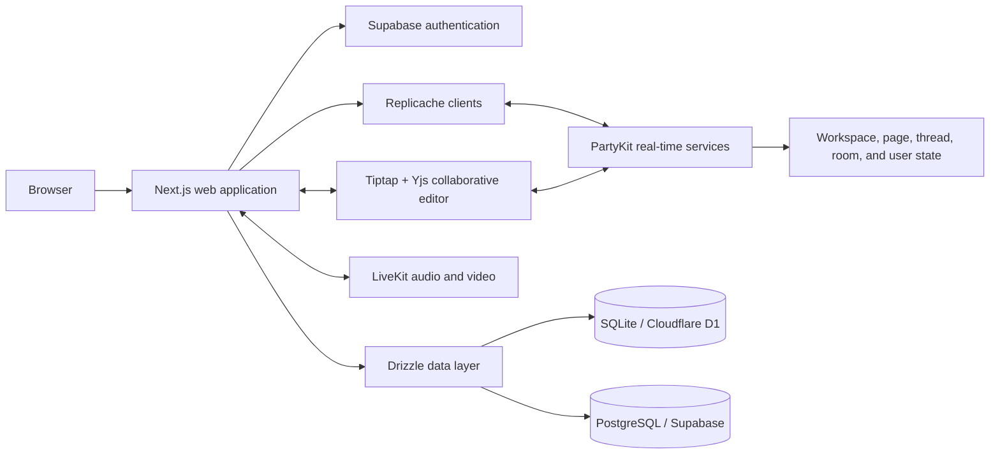

# Wodge

**A local-first collaborative workspace for team communication, knowledge management, and task coordination.**

Read the [repository documentation and feature index](docs/README.md) for the revival specifications, architecture, engineering guidance, and migration review status. The implementation and walkthrough below describe the capstone baseline; the revival targets are not claimed complete.

[](https://nextjs.org/)
[](https://www.typescriptlang.org/)
[](https://replicache.dev/)
[](https://www.partykit.io/)
[](https://supabase.com/)
[](LICENSE)

[](https://youtu.be/IBZvqOu6Xro)

> Watch the [project walkthrough](https://youtu.be/IBZvqOu6Xro) for a complete product tour.

## Overview

Wodge is a collaborative workspace that brings structured team communication, real-time rooms, shared knowledge, and task management into one product. It was built as a five-member engineering capstone and received an **A+ evaluation**.

The project explores a local-first architecture in which users can interact with workspace data through responsive local state while synchronization is coordinated through Replicache and PartyKit services. Collaborative documents use Yjs/CRDT-based editing, and live audio/video rooms are powered by LiveKit.

## Highlights

- **Local-first synchronization** using Replicache with separate synchronized models for workspaces, pages, threads, rooms, and users.
- **Real-time collaboration** through PartyKit services and presence-aware workspace flows.
- **Collaborative documents** built with Tiptap and Yjs/CRDTs.
- **Team communication** through channels, threaded posts, comments, chat, polls, and audio/video rooms.
- **Embedded task management** with assignees, priorities, table views, and Kanban-style organization.
- **Workspace administration** including teams, groups, invitations, membership roles, and permission-aware interfaces.
- **Monorepo architecture** using Turborepo, pnpm workspaces, shared TypeScript configuration, and shared data models.

## Product Capabilities

### Workspaces and access

- Create and join workspaces through invitation flows.
- Organize members into teams and groups.
- Manage workspace, team, and group settings.
- Apply owner, administrator, moderator, and member-aware behavior.
- Track workspace presence and recently visited resources.

### Communication

- Create channels for threaded discussions and live rooms.
- Publish posts, comments, and Q&A-style content.
- Send, edit, and delete real-time room messages.
- Run polls inside collaborative flows.
- Join LiveKit-powered audio/video conferences with device and track controls.

### Knowledge and task management

- Create hierarchical workspace pages.
- Edit rich collaborative documents with Tiptap and Yjs.
- Add structured tasks directly inside documents.
- Manage task priorities, assignees, columns, table layouts, and Kanban views.
- Reorder tasks and columns through synchronized mutations.

## Architecture



### Synchronization model

Wodge separates synchronized state by domain rather than treating the whole product as one global document. Workspace structure, threads, pages, rooms, and user state each have their own models and mutation flows. Replicache handles local-first reads and mutations, while PartyKit coordinates real-time synchronization and presence. Yjs is used specifically for collaborative rich-text editing.

## Technology

| Area | Technologies |
| --- | --- |
| Web application | Next.js, React, TypeScript, Tailwind CSS, Radix UI |
| Local-first data | Replicache, shared mutation models, Zod validation |
| Real-time backend | PartyKit, WebSockets, presence-aware services |
| Collaborative editing | Tiptap, Yjs, y-partykit |
| Audio and video | LiveKit |
| Data layer | Drizzle ORM, SQLite/Cloudflare D1, PostgreSQL/Supabase |
| Authentication | Supabase Auth |
| State and data fetching | TanStack Query, Zustand, Jotai, Immer |
| Tooling | Turborepo, pnpm, Vitest, ESLint, Prettier, Wrangler |
| Deployment | Cloudflare Pages, PartyKit, GitHub Actions |

## Repository Structure

```text
.
├── apps/
│   ├── web/          # Next.js application, UI, routes, editor, and API handlers
│   └── backend/      # PartyKit services for workspace, room, thread, page, and user sync
├── packages/
│   ├── data/         # Shared schemas, models, mutations, keys, and database utilities
│   ├── env/          # Shared environment configuration
│   └── ts/           # Shared TypeScript configuration
├── config/           # Shared development configuration
└── .github/          # GitHub Actions workflows
```

## Getting Started

### Prerequisites

- Node.js 18 or newer
- pnpm 9
- A Linux-based development environment is recommended
- LiveKit Server for local audio/video development
- Accounts or local substitutes for the external services configured in `.env.example`

### Installation

```bash
git clone https://github.com/AMR-21/Wodge.git
cd Wodge
pnpm install
```

Create the application environment files:

```bash
cp .env.example apps/web/.env.local
cp .env.example apps/backend/.env
```

Fill the required values in both files. The repository contains integrations that are not required for every local workflow, so only configure the services you intend to run.

Initialize the local application state and database:

```bash
pnpm init:app
```

Start LiveKit in a separate terminal when testing calls:

```bash
pnpm livekit
```

Start the monorepo:

```bash
pnpm dev
```

You can also run an individual workspace through Turborepo filtering:

```bash
pnpm dev --filter web
pnpm dev --filter backend
```

## Useful Commands

```bash
pnpm dev             # Start development services
pnpm build           # Build all workspaces
pnpm lint            # Run linting across the monorepo
pnpm generate        # Generate database artifacts
pnpm migrate:local   # Apply local database migrations
pnpm studio          # Open the database studio
pnpm reset:app       # Reset local generated PartyKit/Wrangler state
```

## Project Status

The public repository contains the capstone version of Wodge and is suitable for architecture review and local exploration. The codebase includes deployment automation for Cloudflare Pages and PartyKit, but a complete turnkey self-hosting guide is still being consolidated.

Some integrations require third-party credentials, including Supabase, LiveKit, Cloudflare, and other optional services represented in `.env.example`.

## Team and Contribution

Wodge was built by a five-member team. **Amr Yasser served as Scrum Master and contributed across the majority of the monorepo**, including frontend development, backend services, synchronization flows, collaborative editing, and deployment tooling.

## License

Wodge is licensed under the [GNU Affero General Public License v3.0](LICENSE).

## Contact

For questions about the project or self-hosting status, contact [Amr Yasser](mailto:amryasseremam@gmail.com).
