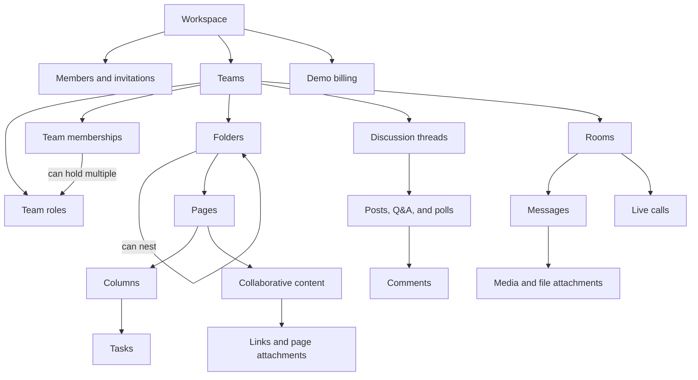
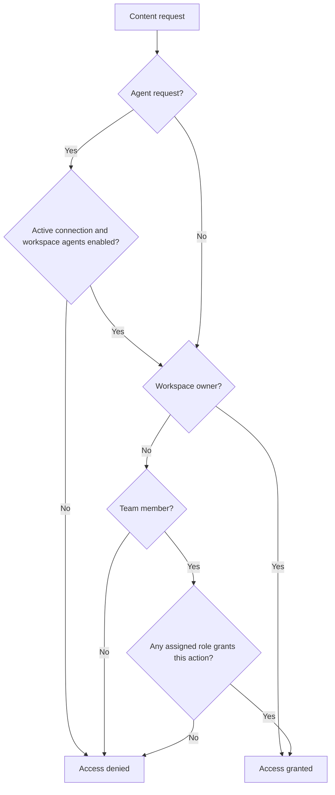

# Domain model, invariants and lifecycles

### Core concepts

A **workspace** is the boundary for its members, teams, content, and demo billing. It has one owner. Other workspace members have an administrator or member role. Only the owner can grant or remove administrator status or delete the workspace. The owner cannot leave or be removed while they own it. Owners and administrators can manage ordinary memberships and invitations.
A workspace has a reusable invitation link and may send an invitation to an email address whether or not that person already has an account. Owners and administrators can enable, disable, or reset the reusable link; reset invalidates the former link. An email invitation is pending until accepted, revoked, or expired. It expires after seven days; owners and administrators can view, resend, and revoke pending invitations. Acceptance requires a signed-in account with the invited verified email address. A new recipient can create and verify an account before accepting. The free/demo premium member limits are 10/50 accepted members, including the owner. Pending invitations do not count, and acceptance cannot exceed the applicable limit. A downgrade may leave more than ten existing accepted members; their access remains, while new joins are blocked until capacity is available again.
Creating a workspace creates a permanent default General team with a Welcome page, room, and discussion thread. Every workspace member belongs to General and receives its Member role; General cannot be deleted, and a person cannot be removed from General without leaving the workspace. A member who leaves or is removed loses workspace and team access; their authored shared content remains, while their team-role and task assignments are cleared.
Only manually selected users may use premium plan features; their eligibility is recorded as a user flag in the database. A workspace has one effective Free or Demo Pro plan. Free permits 10 members, 50 MB pooled user content, four participants in a call, and 60 call participant-minutes per UTC calendar month; Demo Pro permits 50, 500 MB, 12, and 300 respectively. The storage pool combines persisted user-created structured data and files across workspace and team content. At a storage cap, existing content and pending offline edits remain; net growth is blocked until capacity returns. Call use belongs to the workspace's monthly UTC period and counts each connected participant's elapsed time. A verified Stripe test subscription establishes Demo Pro while effective; the operator may pause creation of new workspaces without stopping existing ones.
A **team** contains a subset of workspace members. It contains discussion threads, rooms, and page folders. Page folders can contain other page folders and pages; pages do not contain pages. Pages organize shared resources through links and page attachments; room messages may contain media and file attachments. There is no standalone workspace or team resource library.
The owner and workspace administrators can create or delete non-General teams. A new team starts with its creator as a member and an empty page-folder root. Deleting a team removes its contained spaces and content. The owner and administrators can change a team's details and membership. A team member with **Manage team** can also change that team's name, avatar, and membership; this permission alone grants no content access. A team's **Manage spaces** permission grants creation, renaming, organization, deletion, and role-based access management for its page folders, pages, rooms, and discussion threads. For non-owners, including workspace administrators, these actions require team membership and a granting team role. Editing content remains subject to each space's view/edit grants.
Each team has one built-in **Member** role and can define custom roles. Joining a team assigns Member automatically; Member cannot be deleted. A team member may hold multiple roles in that team. Role grants are additive and contain no explicit denies. Pages, rooms, and discussion threads select roles for viewing and editing; editing includes viewing. New pages, rooms, and threads grant Member view and edit access by default.

A **page** has collaborative rich text and at most one task collection. The task collection may be shown as an embedded table or Kanban board; both views use the same tasks and columns. Removing its embedded view retains the tasks, while deleting the page removes its text, attached files, and tasks. Page edit access governs both rich-text changes and task/column changes. Locally available page changes reconcile after reconnecting.
A **task** belongs to one column on its page and may have multiple assignees. Its title, overview, priority, and due date or range may be set. Assignees are members of the page's team. A discussion thread contains posts, questions, and polls with comments or answers. A room contains text, media/file messages, and polls. A person with a thread's edit access can publish any thread item type or comment; a person with a room's edit access can send its supported messages. A person with view access can vote once per open poll and retract or change that vote while voting remains open.
A room has at most one active call. Its first authorized participant starts the call by joining, and the call ends when its last participant leaves. Room view access allows a person to join and publish their own audio, video, or screen, independently of room message-edit access. Losing room, team, or workspace access ends that person's participation; deleting the room ends its call. Each participant controls only their own media.
An author can edit or delete their own item while they retain access. A question's author can resolve or reopen it; resolution stops new answers. A poll's author can close voting. A team role can grant **Manage discussions**, which allows its holder to resolve questions, close polls, or remove another person's discussion content in a thread or room they can access. This grant is distinct from the built-in Member role and does not itself grant content access.

### Access rules

The workspace owner bypasses team and role restrictions for all actions in that workspace. Files attached to a page inherit that page's view and edit access; files attached to a room message inherit the room's message access. Pages can contain links to other pages or external resources, so shared resource navigation follows page access rather than a separate library permission. There is no workspace or team Manage resources grant.
Everyone else, including workspace administrators, must belong to a team and hold a role that grants the requested action on its content. Workspace administration alone does not grant team-content access. The owner and workspace administrators can manage roles in any team by default. A team member with the high-trust **Manage roles** permission can create, change, delete, and assign custom roles, including to themselves. Deleting a custom role removes its assignments and content grants; changing one updates effective access. Team permissions remain extensible as other capabilities are specified.

An **agent connection** belongs to a workspace member and acts on that member's behalf across workspaces the member can access. The member can revoke the connection. Agent actions are attributed to the member via the agent. A workspace has an agent-access setting controlled by its owner and administrators. When the setting is disabled, agents cannot access that workspace, including agents connected by its owner. When it is enabled, an agent has no more access than its member has under team roles and content permissions.
A task assignee must belong to the page's team. Removing someone from a team removes their team-role assignments and clears their assignments to that team's tasks; the tasks remain.

### Changes from the capstone

The capstone exposed reusable invitation links and seeded a General team and Welcome spaces. The revival retains these behaviors and adds email invitations for people with or without existing accounts. It keeps the capstone's 10/50 member limits. Workspace deletion and administrator-status changes belong to the owner; the old deletion endpoint also permitted administrators despite the owner-only UI.
The capstone had collaborative rich-text pages and a task block backed by page-wide task state. The revival keeps one task collection per page, with table and Kanban views over that collection. A removed task block no longer destroys or hides the underlying task data permanently; the collection can be shown again.
The capstone's team Moderator combined team and space management. The revival separates Manage team from Manage spaces as grantable team permissions. General is permanently present so its automatic workspace membership and starter spaces remain coherent. Non-General team and space deletion removes contained content.
The capstone represented workspace-wide groups and selected groups for page and room viewing or editing. It also had a built-in team moderator and gave workspace administrators broad team-content access. The revival removes groups and the built-in moderator, retaining per-content privilege differences through extensible team roles. Team membership and a granting role gate access to pages, rooms, and discussion threads for everyone except the workspace owner. Administrators may manage team roles but do not bypass content grants. The original thread view check did not require team membership; the revival model does.
The original task model did not enforce team membership for assignees or clear assignments when a person left a team. The revival model requires current team membership and clears those assignments on removal while retaining the tasks.
The capstone restricted regular post publishing to privileged actors while letting ordinary participants create Q&A and polls. The revival allows all thread editors to publish every thread item type. Discussion actions follow thread or room view/edit access for non-owners, and Manage discussions replaces moderator-specific content management.
The capstone's $50 premium model combined estimated Workers, Durable Objects, LiveKit, R2, and hosted AI costs. The revival keeps test billing, displays an illustrative $29 price whose earlier Workers Paid calculation is now superseded, runs on Workers Free, replaces the media/AI assumptions, and introduces smaller pooled storage and call limits; its Financial Assessment records the origin and free-plan limits. The capstone had team file resources governed by its Moderator role and a built-in AI writer. The revival removes standalone libraries and their dedicated file-management grant. Pages and links organize shared resources, while page and room attachments remain under their containing content's permissions. Hosted writing is replaced with member-connected agents. Agent connections and the workspace agent-access setting are new domain concepts.

## Core Concepts

### Workspace and membership

A workspace owns memberships, teams, content, and plan usage. It has one owner, with administrator and ordinary memberships for other people. Reusable links and email invitations provide entry. Accepted workspace members automatically belong to General.

### Teams and roles

A team contains workspace members and its own built-in Member and custom roles. Members may hold multiple additive roles. Teams contain nested page folders, pages, rooms, and discussion threads. Management grants are distinct from content grants.

### Pages and tasks

A page owns collaborative text, links and attachments, and at most one task collection. Tasks belong to columns in that collection. Table and Kanban are views of the same collection. Task assignees must be current members of the page’s team.

### Communication and calls

Threads contain posts, questions, polls, and replies. Rooms contain messages and at most one active call. Media is controlled by each participant; room view access permits call participation.

### Agent connections

A connection belongs to a member and may span the workspaces they can access. The member can revoke it. Each workspace can disable agent access, including the owner’s agents. Actions use the member’s effective permissions and attribution.

### Plans and usage

A workspace has one effective demonstration plan, accepted-member capacity, pooled user-storage usage, and call participant-minute usage for a UTC calendar month. Downgrade preserves existing members and data.

### Canonical domain model

[Domain Model](domain-model.md)

## Rules & Invariants

### Ownership and membership

* Every workspace has exactly one owner. The owner cannot leave or be removed while owning it.
* Only the owner may delete the workspace or grant/remove administrator status.
* General cannot be deleted. Its membership follows workspace membership.
* Email invitation acceptance requires the invited verified address, an invitation still valid, and available member capacity.
* Team membership requires workspace membership. Departure clears team roles and task assignments while shared authored content remains.

### Authorization

* The owner bypasses team and role restrictions.
* Every non-owner, including administrators, requires team membership and a granting role for content access.
* Role grants are additive; there are no explicit denies. Edit includes view.
* Manage team, Manage spaces, Manage roles, and Manage discussions remain separate grants.
* Management authority alone does not grant content access.
* Attachments inherit their page or room access. There is no separate resource-library permission.

### Content

* Folders may contain folders and pages; pages do not contain pages.
* A page owns at most one task collection. Table and Kanban share its tasks and columns.
* Removing a task view preserves the collection. Deleting the page removes its text, files, and tasks.
* Task assignees must belong to the page’s team.
* Thread editors may publish all supported item types. Viewers may vote in an open poll, with one changeable/retractable vote.
* Resolved questions stop new answers. Closed polls stop voting.

### Calls and agents

* A room has at most one active call; the last departure ends it.
* Room view access permits joining and publishing the participant’s own media.
* Losing room, team, or workspace access ends participation.
* An agent requires an active member connection and enabled workspace agent access.
* Agents have no more access than the member. The disabled workspace setting also applies to owner-connected agents.

### Limits

Member acceptance, net storage growth, and call admission follow the effective plan. Downgrade does not silently remove people, content, or pending offline edits. Verified subscription state establishes plan changes; a browser return alone does not.

### Source

[Domain Model](domain-model.md)

## Lifecycles

### Workspace and team

Workspace creation establishes its owner, General, and Welcome page, room, and thread. Joining establishes membership and General’s Member role. Departure ends workspace/team access, clears roles and task assignments, and retains shared authored content. Owner-confirmed workspace deletion removes memberships and content.
A non-General team starts with its creator and an empty page-folder root. Team removal clears the person’s team roles and assignments. Authorized deletion removes the team and its spaces/content. General remains permanent.

### Invitations

Email invitations move from pending to accepted, revoked, or expired. Expiry is seven days. Acceptance requires the invited verified account and capacity. Resending and revoking are invitation-management actions.
Reusable invitation links can be enabled, disabled, or reset. Reset invalidates the former link.

### Roles and content

Joining a team assigns Member. Custom-role changes alter effective access; deleting a custom role removes its assignments and grants.
Removing a task block retains its page’s collection; restoring the block presents the same tasks. Deleting the page removes text, files, and tasks. Deleting a room ends its call.
Questions can be resolved and reopened. Resolution stops new answers. Poll authors or eligible discussion managers can close voting; results remain.

### Calls

The first authorized join starts a room call. Microphone and camera start off. Navigating within Wodge keeps the call available; switching rooms requires confirmation. The last departure ends the call. Access loss disconnects the affected person. Monthly call-allowance exhaustion ends the call.

### Agent connections

A member establishes a connection, uses permitted actions, and may revoke it. Permission changes affect subsequent actions. Disabling workspace agent access blocks all agents in that workspace.

### Plan changes

An effective verified Stripe test subscription establishes Demo Pro. After it ceases to be effective, Free limits apply. Existing people and content remain on downgrade; new joins and net storage growth can be blocked. Call usage resets each UTC calendar month.

### Source

[Domain Model](domain-model.md)

## Sources and revisions

- Migrated from [Domain Model](https://linear.app/amr21/document/domain-model-f519f5c6a90c), document ID `e0e477bc-1081-4ed4-901a-5e91b1733f3c`.
- Source revision: 2026-10-06T23:35:35.136Z; source author: Amr Yasser; last editor: Amr Yasser.
- Repository migration revision: `migration-draft-1`, 2026-10-09. The user confirmed preparation and placement in this chat. Approval of this rewritten repository revision and remote canonical-link cutover is pending.
- Existing decision/approval statements are source evidence, not new approvals or proof of implementation.

### Additional source

- Migrated from [Core Concepts](https://linear.app/amr21/document/core-concepts-2d71f01ea0fd), document ID `b967624b-009e-46e4-b113-20aa933bb6bf`.
- Source revision: 2026-10-06T23:59:11.941Z; source author: Amr Yasser; last editor: Amr Yasser.
- Repository migration revision: `migration-draft-1`, 2026-10-09. The user confirmed preparation and placement in this chat. Approval of this rewritten repository revision and remote canonical-link cutover is pending.
- Existing decision/approval statements are source evidence, not new approvals or proof of implementation.

### Additional source

- Migrated from [Rules & Invariants](https://linear.app/amr21/document/rules-and-invariants-bb59eda10f7f), document ID `6150f14b-b247-4ac2-920a-f91f223a9e93`.
- Source revision: 2026-10-06T23:59:20.601Z; source author: Amr Yasser; last editor: Amr Yasser.
- Repository migration revision: `migration-draft-1`, 2026-10-09. The user confirmed preparation and placement in this chat. Approval of this rewritten repository revision and remote canonical-link cutover is pending.
- Existing decision/approval statements are source evidence, not new approvals or proof of implementation.

### Additional source

- Migrated from [Lifecycles](https://linear.app/amr21/document/lifecycles-47a2da34611a), document ID `0ec81b53-816d-4ffc-9ea9-de11692bf28b`.
- Source revision: 2026-10-06T23:59:02.684Z; source author: Amr Yasser; last editor: Amr Yasser.
- Repository migration revision: `migration-draft-1`, 2026-10-09. The user confirmed preparation and placement in this chat. Approval of this rewritten repository revision and remote canonical-link cutover is pending.
- Existing decision/approval statements are source evidence, not new approvals or proof of implementation.
