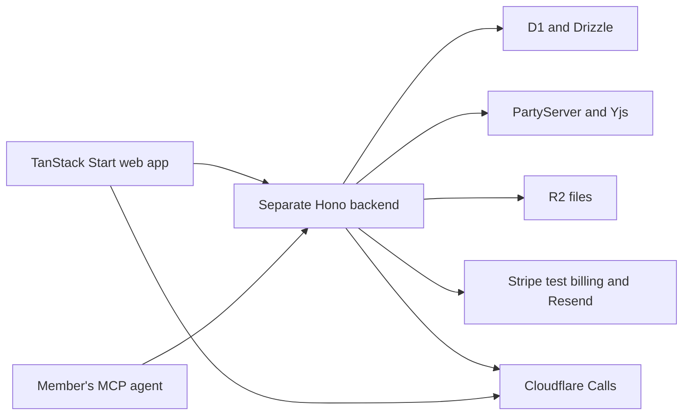

# Architecture

The target and capstone evidence below retain their original distinction. Current source inspection on 2026-10-09 found the same capstone baseline at commit `d875c2d369f2bed15ba4e7257242131fddcbfa0a`. No runtime checks were executed.

## Architecture overview

### Architecture

Wodge keeps a separate backend serving shared APIs to its TanStack Start web application. That boundary allows a possible future mobile client; building mobile is outside the revival.

### Collaboration

Replicache remains the structured local-first synchronization system. Yjs handles collaborative page text. PartyServer replaces PartyKit directly on Cloudflare Workers, using the needed Yjs server addons and removing unnecessary boilerplate.

### Integration targets

Better Auth replaces Supabase Auth. Cloudflare Calls replaces LiveKit. Member-provided MCP agents replace the built-in hosted AI writer.
The web UI moves to React 19, Tailwind CSS 4, and shadcn/ui with Base UI. TypeScript 7, latest pnpm/Turborepo, Oxlint, and Oxfmt form the confirmed tooling target.

### Scope

Revive the existing product with a fresh deployment. Old accounts/data need not be migrated. Retained major capabilities remain part of the portfolio showcase.

### Runtime topology

The backend contains Hono HTTP APIs, Better Auth over D1, the approved Better Auth MCP plugin, PartyServer realtime services, and server-side calls/billing integrations. The web application is a separate client and rendering application. R2 supplies file storage; Resend supplies email.

### Migration evidence

The main branch audited on 1 October 2026 still uses Next.js, Supabase, PartyKit, and LiveKit. Web-hosted API routes and Next-specific data access are current implementation facts, not the target architecture.
[apps/web/package.json](<https://github.com/AMR-21/Wodge/blob/d875c2d369f2bed15ba4e7257242131fddcbfa0a/apps/web/package.json>)
[apps/backend/partykit.json](<https://github.com/AMR-21/Wodge/blob/d875c2d369f2bed15ba4e7257242131fddcbfa0a/apps/backend/partykit.json>)
[packages/data/lib/create-db.ts](<https://github.com/AMR-21/Wodge/blob/d875c2d369f2bed15ba4e7257242131fddcbfa0a/packages/data/lib/create-db.ts>)

### Related knowledge

[Tech Stack](tech-stack.md)

## System Boundaries

### Web application

TanStack Start provides the web application. It consumes the separate backend’s APIs.

### Shared backend

The backend remains a separate service so its APIs can serve the web application and a possible future mobile application. Shared product operations reside in the backend, independently of the web framework.
Hono owns the shared HTTP boundary. Better Auth owns authentication over the existing D1 database; its approved MCP plugin provides agent authorization. PartyServer owns realtime server behavior. Stripe webhooks, shared workspace/user operations, content authorization, file access, and call admission are backend responsibilities.

### Client and service trust

The browser and connected agents are external clients. Client-provided identities, role flags, plan claims, and resource identifiers do not establish permission. The backend derives the acting member from verified authentication and resolves current workspace, team, and resource access.
Secrets and provider credentials remain server-side in Cloudflare. Browser-visible configuration contains only public connection information.

### Existing boundary violations

The current web app owns API routes for billing, users, workspaces, rooms, and Replicache. Its Stripe webhook changes workspace state and pokes the realtime backend. The shared D1 factory imports Next-on-Pages request context. These couplings must be removed to satisfy the confirmed separate-backend boundary.
[apps/web/src/app/api/billing/webhook/route.ts](<https://github.com/AMR-21/Wodge/blob/d875c2d369f2bed15ba4e7257242131fddcbfa0a/apps/web/src/app/api/billing/webhook/route.ts>)
[packages/data/lib/create-db.ts](<https://github.com/AMR-21/Wodge/blob/d875c2d369f2bed15ba4e7257242131fddcbfa0a/packages/data/lib/create-db.ts>)

### Future mobile client

A mobile application is a possible future client of the same backend. Building that client is outside the confirmed revival delivery scope.

### Related stack

[Tech Stack](tech-stack.md)

## Data & Request Flows

### Shared product requests

The web client calls the separate backend’s shared APIs. Non-owner content actions require team membership and a granting role. A future mobile client can use the same backend boundary.

### Structured changes

Locally available structured interactions use Replicache and reconcile with shared state. Backend mutations enforce membership, roles, task-assignee constraints, and effective usage limits. Valid changes reconcile after reconnecting; denied growth does not silently erase pending local work.

### Collaborative text

Authorized page editors collaborate through Yjs and the PartyServer runtime. Page permission applies to text as well as tasks and attachments. Presence and synchronization failures are visible.

### MCP actions

An agent request requires an active member connection and enabled workspace agent access, then follows the member’s current content permissions. Accepted actions carry member-via-agent attribution and appear through ordinary synchronization.

### Calls

A room-view-authorized participant starts or joins a Cloudflare Calls-backed call. Media begins off and stays under that participant’s control. Access loss disconnects them; the last departure ends the call. Workspace participant-minute accounting governs admission and exhaustion.

### Plans

A verified Stripe test subscription determines the effective workspace plan. Authenticated events are applied idempotently. Member admission, net storage growth, and calls follow backend-enforced limits; a browser return alone cannot activate a plan.

### Authentication and agent authorization

Better Auth handles backend authentication with D1-backed state. Its official MCP plugin supplies standard agent authorization. An authenticated agent still passes Wodge's connection, workspace-setting, membership, and resource checks on each action.
The current visible sign-in UI offers email OTP, Google, and GitHub. These existing journeys belong to the authentication migration; changing the auth provider does not itself select new sign-in behavior.
[apps/web/src/app/(auth)/login/otp.tsx](<https://github.com/AMR-21/Wodge/blob/d875c2d369f2bed15ba4e7257242131fddcbfa0a/apps/web/src/app/(auth)/login/otp.tsx>)
[apps/web/src/app/(auth)/login/oauth.tsx](<https://github.com/AMR-21/Wodge/blob/d875c2d369f2bed15ba4e7257242131fddcbfa0a/apps/web/src/app/(auth)/login/oauth.tsx>)

### Replicache protocol responsibilities

Current backend sync separates user, workspace, page, thread, and room state. Push requests contain a client group and ordered mutations. The backend checks ownership, skips previously processed mutation IDs, and rejects sequence gaps. Pull responses contain the current cookie, mutation acknowledgements, and data patches. Poke messages trigger clients to refresh shared state.
The runtime migration preserves those synchronization responsibilities. A rejected change must remain distinguishable from an accepted mutation; the approved UX requires visible pending/failed changes.
[apps/backend/src/lib/replicache.ts](<https://github.com/AMR-21/Wodge/blob/d875c2d369f2bed15ba4e7257242131fddcbfa0a/apps/backend/src/lib/replicache.ts>)

### Page collaboration

The current page service combines page-task push/pull routes and Yjs collaboration. Its Yjs configuration uses persisted snapshots and read-only connections for non-editors. The migration preserves durable document recovery and separate view/edit enforcement while replacing y-partykit with the PartyServer Yjs integration.
[apps/backend/src/page/page-party.ts](<https://github.com/AMR-21/Wodge/blob/d875c2d369f2bed15ba4e7257242131fddcbfa0a/apps/backend/src/page/page-party.ts>)

### References

[Team Roles & Access](../features/team-roles-access/spec.md)
[Pages & Embedded Tasks](../features/pages-embedded-tasks/spec.md)
[Agent Access](../features/agent-access/spec.md)
[Room Calls](../features/room-calls/spec.md)
[Demo Billing & Limits](../features/demo-billing-limits/spec.md)

## Persistence and deployment

[Persistence and data ownership](data-model.md) retains the original persistence section. [Environments and runtime topology](../operations/environments.md) retains the deployment section.

## Source and revision

- Migrated from [Architecture](https://linear.app/amr21/document/architecture-15a3790a91f7), document ID `219776f3-b3d9-4b90-b493-9ae8aa9b9163`.
- Source revision: 2026-10-06T23:57:23.209Z; source author: Amr Yasser; last editor: Amr Yasser.
- Repository migration revision: `migration-draft-1`, 2026-10-09. The user confirmed preparation and placement in this chat. Approval of this rewritten repository revision and remote canonical-link cutover is pending.
- Existing decision/approval statements are source evidence, not new approvals or proof of implementation.
